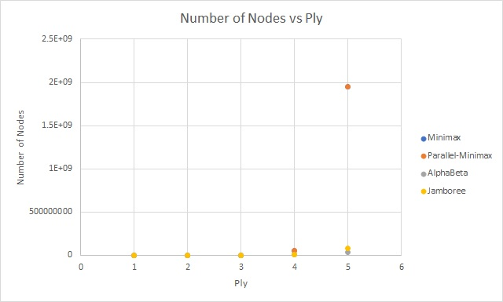
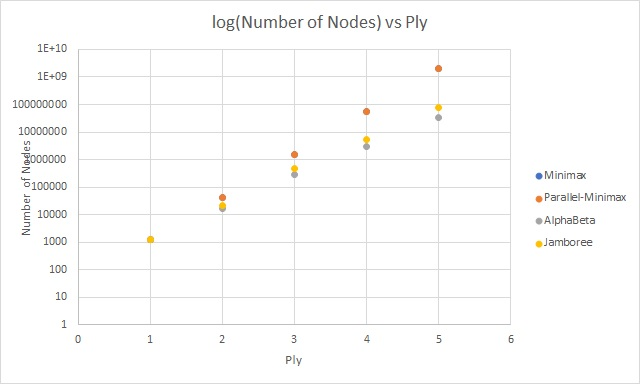
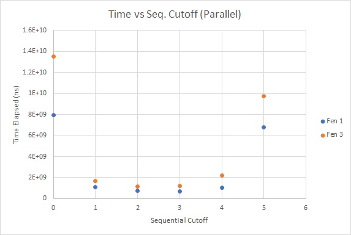
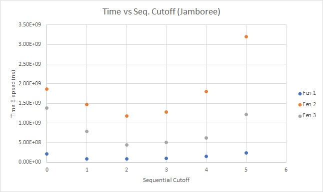
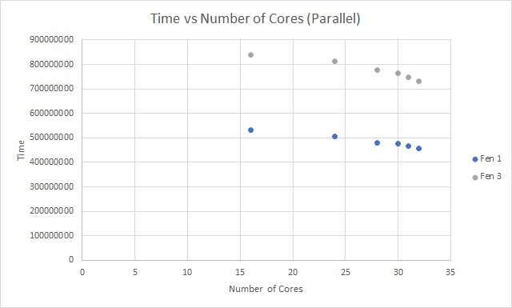
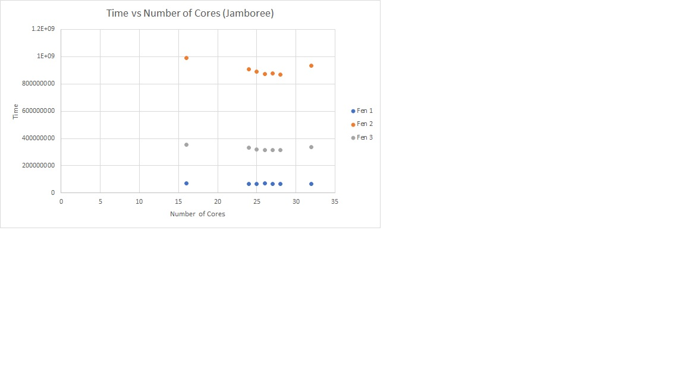
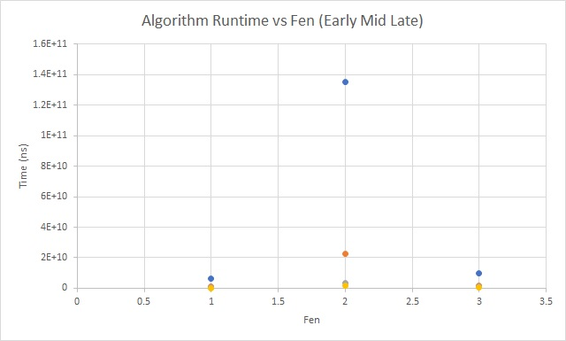
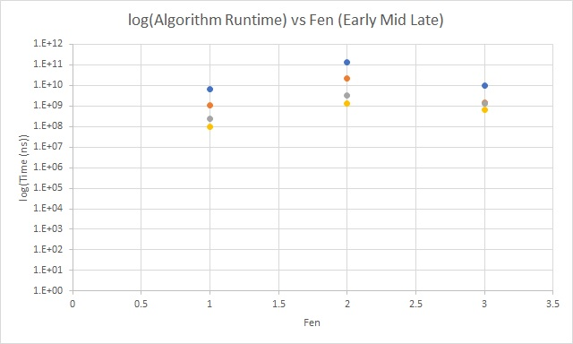

# Project 3 (Chess) Write-Up #
--------

## Project Enjoyment ##
- How Was Your Partnership?
  <pre>
  Great. We got along well and were easily able to find time to meet with each other. 
  </pre>
  
- What was your favorite part of the project?
  <pre>
  Our favorite part was when we realized that move ordering solves everything.
  </pre>

- What was your least favorite part of the project?
  <pre>
  Server lag leading up to the due date. It's hard to beat clamps when every move takes 10 times longer than
  normal and everything times out.  
  </pre>

- How could the project be improved?
  <pre>
Less server lag. We found great difficulty is completing our bot because we were unable to see it play in real time.
During the lag, the match essentially became a 50/50 coin flip on who would win. Whoever went first would lose because
they would time out after the first 4-6 moves. So we are getting a lot of draws with clamps but we are graded on
winning 8/10 matches. Until we beat clamps, it was very frustrating. Secondly, virtual TA office hours. Often times 
we cannot schedule time to meet with a TA together. And in TA office hours, the queue is arbitrary and some people 
end up being seen before other people because they were able to get the TA's attention even though they arrived later. 
Virtual office hours solves availability and queueing problems.  
  </pre>

- Did you enjoy the project?
  <pre>
  Overall the project had its enjoyable moments. Mostly when we passed tests and beat bots.
  (Tim) There were definitely some pain points like understanding the Jamboree algorithm.
  </pre>
    
-----

## The Chess Server ##
- When you faced Clamps, what did the code you used do?  Was it just your jamboree?  Did you do something fancier?
  <pre>
  We created a derivative of Jamboree that we named ClampsBeater.  ClampsBeater was modified to return a stack of moves
  rather than a single move, and used this stack for iterative deepening.  We also implemented simple move ordering
  based solely on the evaluation of the next board state.  Finally, we added logic to reduce ply if time began running
  low, but it tended to be either unnecessary or ineffective depending on if the server was lagging or not.
  We also began implementation of a transposition table, but abandoned it once our other optimizations allowed us to
  consistently beat clamps.
  </pre>

- Did you enjoy watching your bot play on the server?  Is your bot better at chess than you are?
  <pre>
  Yes, we enjoyed being able to watch the tangible effects of our code development through the bot playing on the server. In
  general, the bot is much better at chess than we are.  However, there were some moments where there were clear paths
  to victory (pushing pawns to the other side, continuing to press a piece advantage, etc.) where the bot instead chose
  to draw, presumably because it couldn't find a short-term option better than drawing.
  </pre>

- Did your bot compete with anyone else in the class?  Did you win?
  <pre>
  We played against creampuff and lassie, and generally drew.  We also played against buccellato, and were easily mated
  in the mid to late game.
  </pre>

- Did you do any Above and Beyond?  Describe exactly what you implemented.
  <pre>We beat clamps 10 times using our combination of iterative deepening, move ordering/sorting, and time-context ply-switching.
  Aside from that, no.
  </pre>

## Experiments ##

### Chess Game ###

#### Hypotheses ####

<pre>
  NOTE: For all of our experiments, we warmed up the JVM before timing the results (usually through running
  the entire test once through and then timing when we ran it again).  Additionally, all of the timing values
  are the average of multiple runs of the test.  In cases where one of the tests was clearly an outlier
  (something like 100x the other results), we discarded it from the average.  Finally, we kept everything
  constant unless specified otherwise.
</pre>


Suppose your bot goes 3-ply deep.  How many game tree nodes do you think
it explores (we're looking for an order of magnitude) if:
 - ...you're using minimax?
    <pre>
    We think our minimax bot looks at all possible moves at each ply. This translates to 35^3, where 35 is the average
    branching factor in chess. This is because the minimax algorithm looks at every move and does not prune or exclude
    moves in its search. This is about 43000 moves.
    </pre>
 - ...you're using alphabeta?
    <pre>
    In alpha-beta pruning we are not evaluating every possible move at each depth because we have a valid range that is
    bound by alpha and beta. The number of moves we prune at a level is dependent on the order of the moves we visit.
    If we visit moves that quickly make beta less than or equal to a, we will visit many fewer nodes than an order of
    moves that keeps the valid range open. Maybe a good approximation is that we will visit half of the possible moves
    on each level, so 17^3, which is about 5000 moves.
    </pre>

#### Results ####
Run an experiment to determine the actual answers for the above.  To run
the experiment, do the following:
1. Run SimpleSearcher against AlphaBetaSearcher and capture the board
   states (fens) during the game.  To do this, you'll want to use code
   similar to the code in the testing folder.
2. Now that you have a list of fens, you can run each bot on each of them
   sequentially.  You'll want to slightly edit your algorithm to record the
   number of nodes you visit along the way.
3. Run the same experiment for 1, 2, 3, 4, and 5 ply. And with all four
   implementations (use ply/2 for the cut-off for the parallel
   implementations).  Make a pretty graph of your results (link to it from
   here) and fill in the table here as well:


|      Algorithm     | 1-ply | 2-ply | 3-ply |  4-ply |   5-ply  |
| :----------------: |:-----:|:-----:|:-----:|:------:|:--------:|
|       Minimax      | 1238  | 43414 |1520569|54245664|1952117414|
|  Parallel Minimax  | 1238  | 43414 |1520569|54245664|1952117414|
|      Alphabeta     | 1238  | 16633 | 295487| 3013155| 33558022 |
|      Jamboree      | 1238  | 20885 | 468455| 5168740| 79122869 |




#### Conclusions ####
How close were your estimates to the actual values?  Did you find any
entry in the table surprising?  Based ONLY on this table, do you feel
like there is a substantial difference between the four algorithms?
<pre>
Data:Nodes.csv
Node-wise, it is readily apparent that AlphaBeta reigns supreme,
which would make perfect sense since AlphaBeta will ALWAYS discard
nodes if it is (mathematically) able to do so.  Similarly, both
versions of minimax are awful because they never discard any nodes
period.  I think the most surprising aspect, though, is just how much of
a difference there is between AlphaBeta (and to a lesser extent
Jamboree) and Minimax at higher plies, especially at 5 ply where
AlphaBeta had just over 1% of Minimax's nodes.
As for our hypothesis, the actual approximate values would be 35^(ply + 1),
at least based on these results.  This is due to the fact that we are looking
ply ahead in addition to the current move, so we would add one more to the
exponent. So our estimates for the non-pruning algorithms was off by a factor
of 35. Our estimates for the pruning algorithms was off by more. Instead of 
17 possible moves per turn, a more reasonable pruning would be perhaps 25 moves.
25^(ply + 1) more accurately matches the tested results.
We feel there is a substantial difference between the Minimaxes vs. AlphaBeta/Jamboree
whereas the difference between AlphaBeta and Jamboree is less substantial is magnitude
but still significant, especially for 3 minute chess games.
</pre>

### Optimizing Experiments ###
THE EXPERIMENTS IN THIS SECTION WILL TAKE A LONG TIME TO RUN. 
To make this better, you should use Google Compute Engine:
* Run multiple experiments at the same time, but **NOT ON THE SAME MACHINE**.
* Google Compute Engine lets you spin up as many instances as you want.

#### Generating A Sample Of Games ####
Because chess games are very different at the beginning, middle,
and end, you should choose the starting board, a board around the middle
of a game, and a board about 5 moves from the end of the game.  The exact boards
you choose don't matter (although, you shouldn't choose a board already in
checkmate), but they should be different.

#### Sequential Cut-Offs ####
Experimentally determine the best sequential cut-off for both of your
parallel searchers.  You should test this at depth 5.  If you want it
to go more quickly, now is a good time to figure out Google Compute
Engine.   Plot your results and discuss which cut-offs work the best on each of
your three boards.




<pre>
Data: SeqCutoffData.csv, Fen1 = starting board, Fen2 = mid-game, Fen3 = end game board
Overall, both algorithms were consistent relative to each other.  For both, a
cutoff of 0, meaning virtually no sequential work, was really bad.  Similarly,
a cutoff of 5, meaning no parallel work, was also really bad.  Interestingly,
5 is worse than 0 on Jamboree, but the opposite is true for Parallel Minimax.
As for the other options, 1 and 4 were generally okay, but still not the best,
presumably because they too delegate too much work to either parallel or
sequential, and therefore not split it effectively.  This left 2 and 3 as the
sweet spots of both algorithms, splitting parallel and sequential work almost
evenly.  These trends were consistent across all 3 boards as well, with the
only difference being the actual scale of the time taken.  Specifically, the
mid-game fen consistently took longest, but still was optimized by a cutoff
of 2 or 3.
Also interestingly, we tested ClampsBeater a few times with various cutoffs,
but it actually tended to be worse at a cutoff 2 or 3.  This is most likely
due to the fact that we did not extend our optimizations to AlphaBeta's
sequential algorithm at all.  We did not record data from this, as it was
just one-off testing on our personal laptops, but we thought that it was
an interesting sidenote.
</pre>


#### Number Of Processors ####
Now that you have found an optimal cut-off, you should find the optimal
number of processors. You MUST use Google Compute Engine for this
experiment. For the same three boards that you used in the previous 
experiment, at the same depth 5, using your optimal cut-offs, test your
algorithm on a varying number of processors.  You shouldn't need to test all 32
options; instead, do a binary search to find the best number. You can tell the 
ForkJoin framework to only use k processors by giving an argument when
constructing the pool, e.g.,
```java
ForkJoinPool POOL = new ForkJoinPool(k);
```
Plot your results and discuss which number of processors works the best on each
of the three boards.




<pre>
Data: Cores.csv
Rather predictably, more cores tends to make parallel minimax run faster.  Thus,
the "optimal" amount of cores we can give the program access to on a 32 core
machine is 32.  That being said, the improvements, while definitely noticeable,
were not massive, shaving maybe 15% off of runtime going from 16 to 32 cores.
These results were consistent across all three board states.
Jamboree, on the other hand, actually peaked in performance from 25-28 cores.
on the various boards.  To be exact, fen 1's best performance was on 25, and fen 2's
and fen 3's was on 28.  Performance around this point was relatively consistent for
all three fens, however.
While we are not 100% sure why this is the case, we think that it may have
to do with the fact that while Jamboree creates threads as if it was going to
search every single node, many subnodes get skipped, meaning a thread, in the
worst case, may be forked only to do virtually nothing.  In this case, it is
possible that running on too many cores causes these threads to get put on
an entirely separate processor than the parent, do basically nothing, and then
have to get sent back to the parent's thread in order to join.  On a lower
number of cores, however, they may be more likely to simply be scheduled
back-to-back, and thus can fork and rejoin faster.  So we have overhead work
in setting up the threads and cores, but reap none of the benefits because 
we don't use those cores due to pruning. Another possibility is
that using fewer than 32 cores allows the OS to handle its own work on its
own core, and thus our algorithm can dominate the other 31, but if this were
the case, we'd expect to see the parallel minimax algorithm to have similar
results.
</pre>

#### Comparing The Algorithms ####
Now that you have found an optimal cut-off and an optimal number of processors, 
you should compare the actual run times of your four implementations. You MUST
use Google Compute Engine for this experiment (Remember: when calculating
runtimes using *timing*, the machine matters).  At depth 5, using your optimal 
cut-offs and the optimal number of processors, time all four of your algorithms
for each of the three boards.

Plot your results and discuss anything surprising about your results here.

|      Algorithm     | Early Game |  Mid Game  |  End Game |
| :----------------: |:----------:|:----------:|:---------:|
|       Minimax      | 6556534891 |135416704499|10025632794|
|  Parallel Minimax  | 1042318352 | 22615267908| 1500809298|
|      Alphabeta     |  236946953 | 3281470649 | 1258679513|
|      Jamboree      |  100785935 | 1366489823 | 625877563 |




<pre>
Overall, the results are pretty predictable.  Each algorithm from Minimax to Jamboree
is significantly better than the one before it.  However, the amount of difference
between each algorithm is quite interesting.  ParallelMinimax is consistently about 6x
faster than normal Minimax, but AlphaBeta has much less consistent improvement.  In
the early game, it was roughly 4x faster than Parallel, in the midgame, it was up to
7.5x faster, but in the end game, it was only 1.2x faster.  Possibly, the source of
this inconsistency is the random nature of AlphaBeta's search; since it is random
what nodes AlphaBeta searched in which order, it may have had particularly good or
bad luck, leading to the massive difference in relative speed. Another possible reason
for AlphaBeta's end-game malaise is that there is less pruning being done because many of the
board states are similar in value (lots more empyt spaces in the end game) so fewer get 
pruned by the bounds.  Jamboree, however, was consistently around twice as fast as standard 
AlphaBeta.  Presumably, this relatively stable ratio is the result of the fact that, while 
Jamboree is random as well, it is random in the exact same manner as AlphaBeta, and 
searches in the exact same order.  Therefore, where one performs poorly, the other does as well. 
Jamboree also shows the power of parallelism. Despite visiting more nodes than AlphaBeta, Jamboree
is able to leverage parallelism to get a 50% reduction in time despite whatever random node
ordering and node pruning happens. This test did not reveal anything else that is particularly exciting.
</pre>

### Beating Traffic ###
In the last part of the project, you made a very small modification to your bot
to solve a new problem.  We'd like you to think a bit more about the 
formalization of the traffic problem as a graph in this question.  
- To use Minimax to solve this problem, we had to represent it as a game. In
  particular, the "states" of the game were "stretches of road" and the valid
  moves were choices of other adjacent "stretches of road".  The traffic and
  distance were factored in using the evaluation function.  If you wanted to use
  Dijkstra's Algorithm to solve this problem instead of Minimax, how would you
  formulate it as a graph?
  <pre>
  If we were using Dijkstra's algorithm, we use intersections (loosely defined
  as any point in which multiple roads connect) as nodes in the graph, and the
  roads between them as edges.  We would weight the edges with amount of time
  it takes to travel along that edge, whether due to the speed limit, distance,
  or traffic.</pre>

- These two algorithms DO NOT optimize for the same thing.  (If they did,
  Dijkstra's is always faster; so, there would be no reason to ever use
  Minimax.)  Describe the difference in what each of the algorithms is
  optimizing for.  When will they output different paths?
  <pre>
  The Minimax algorithm (or alpha-beta in our chosen implementation) optimizes for
  keeping the player/driver out of traffic as much as possible while still arriving
  in the alloted time.  In contrast, with the graph described above, Dijkstra's
  algorithm optimizes for the fastest route, factoring in, but not necessarily
  avoiding, traffic.  Thus, if you're trying to path from one end of downtown to
  another with a maximum time of 30 minutes, Dijkstra's algorithm might route you
  straight through the heaviest traffic and get you there in 20 minutes, while Minimax
  will stick to lesser used roads, but get you there in 25 minutes.  As a more
  extreme example, assuming the time limit was suitably large, minimax might
  literally direct you to drive around the entire world in order to minimize
  traffic, even if your destination was only two blocks away through heavy
  traffic.  Dijkstra's algorithm would just direct you to go through it, since two
  blocks of traffic is much less time than circumnavigating the globe.
  </pre>